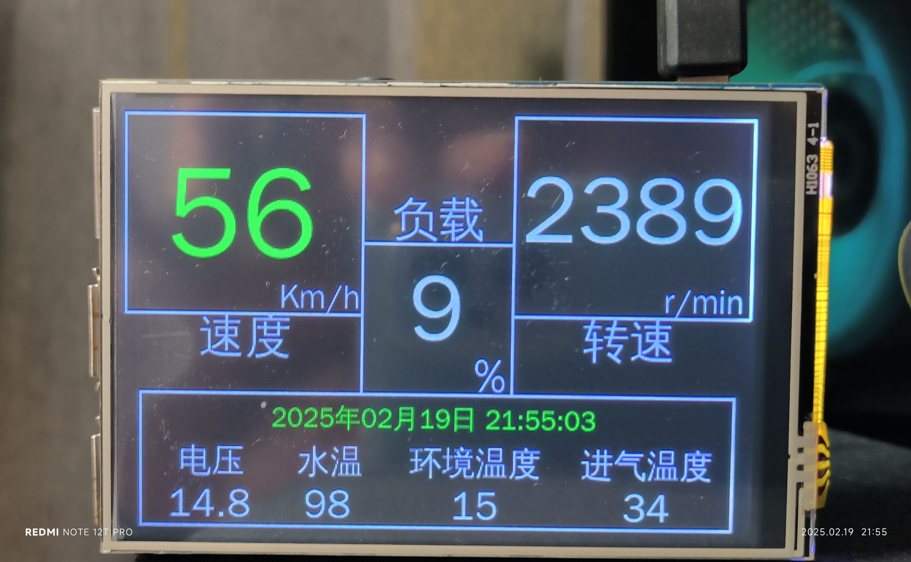

# raspdash

Raspberry Pi connects to OBD via Bluetooth

# Raspberry
- flash os with desktop
- apt update && apt upgrade -y && apt full-upgrade -y
- apt install pip
- pip install git+https://github.com/luckkyboy/python-OBD.git

# connect obd adapater via Bluetooth
- bluetoothctl
  - power on
  - agent on
  - scan on
  - pair 00:1D:A5:07:31:7A
  - trust 00:1D:A5:07:31:7A
  - scan off
  - quit

# connect car with Screen (apt install screen)
- screen /dev/rfcomm0
  - ate0  <-- return ok
  - atz
  - atl1
  - ath1
  - atsp0  <-- use protocol auto, available protocols: 1,2,3,4,5,6,7,8,9,A
  - 0100  <-- mode 01, pid 00, supported pids

# connect car with obd
- chmod +x ./start.sh && ./start.sh
- Run python script: python dash.py
- Add to rc.local if you want