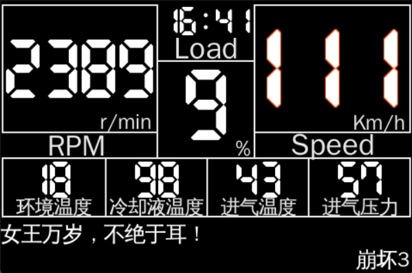

__English__ · [简体中文](README.zh-CN.md)

---

### Raspberry Pi connects to OBD via Bluetooth
#### Preview

#### Chinese version:

# Parts list
- Raspberry pi 3B+
- Wave Share 3.5inch RPi LCD (B)
- TF card
- Car Mount Holder (*optional)

# 1. connect obd adapater via Bluetooth
### replace your_bluetooth_mac_address with your OBD bluetooth mac address
- bluetoothctl
  - power on
  - agent on
  - scan on
  - pair your_bluetooth_mac_address
  - trust your_bluetooth_mac_address
  - scan off
  - quit

[//]: # (# 2. connect car with Screen &#40;*optional&#41;)

[//]: # (### apt install screen)

[//]: # (- screen /dev/rfcomm0)

[//]: # (  - ate0  <-- return ok)

[//]: # (  - atz)

[//]: # (  - atl1)

[//]: # (  - ath1)

[//]: # (  - atsp0  <-- use protocol auto, available protocols: 1,2,3,4,5,6,7,8,9,A)

[//]: # (  - 0100  <-- mode 01, pid 00, supported pids)

# 2. Install in Raspberry 3B+
- flash raspberry os bullseye with desktop 64 bit
- connect network
- bash <(curl -ls https://raw.githubusercontent.com/luckkyboy/raspdash/refs/heads/main/install_en_us.sh)
- In ~/dash/start.sh replace your_bluetooth_mac_address with your OBD bluetooth mac address
- reboot and enjoy!